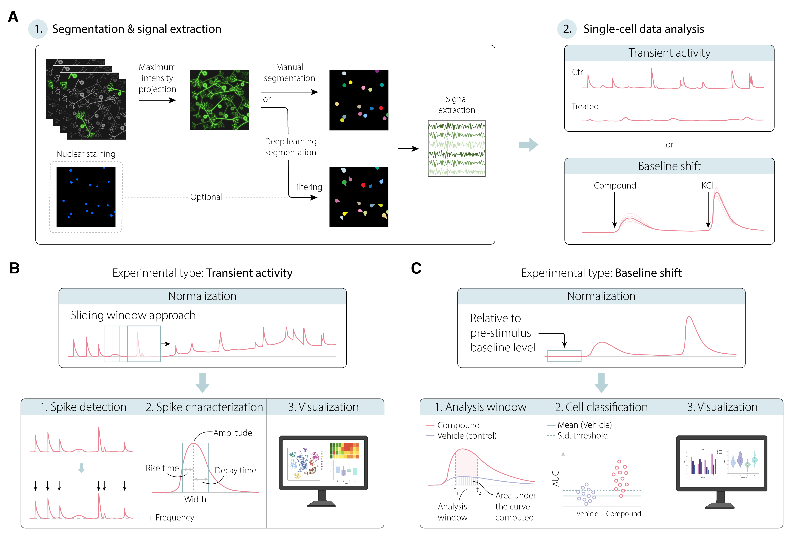

# LUMIN (Live-cell User Module for Imaging and analysis of Neuronal activity)

Lumin is a ....



## Documentation
To be updated ... 


## Installation
Lumin has been tested on MacBook Pro with M2 chip and Windows 11 Pro x64 with NVIDIA GPU. Separate installation guides should be followed for macOS and Windows operating systems. It is recommended to install LUMIN into a conda environment hosting all software dependencies of LUMIN.

If Miniconda (or Anaconda) is not installed to the system one can do so by following the instructions on [Miniconda installation page](https://www.anaconda.com/docs/getting-started/miniconda/install). 


#### macOS
1. Clone LUMIN GitHub repository:
```bash
git clone https://github.com/kirkebylab/LUMIN.git
```

3. Navigate to the cloned folder:
```bash
cd LUMIN
```
5. Create conda environment:
```bash
conda create -n lumin_env python -c conda-forge -y
``````

6. Activate conda environment:
```bash
conda activate lumin_env
```

7. Install LUMIN to the conda environment:
```bash
pip install -e .
```
8. Install jupyter kernel (optional, enables downstream analysis or figure polishing of LUMIN generated tabular output):
```bash
python -m ipykernel install --user --name=ca_env
```

#### Windows
1. Clone LUMIN GitHub repository:
```bash
git clone https://github.com/kirkebylab/LUMIN.git
```

3. Navigate to the cloned folder:
```bash
cd LUMIN
```
5. Create conda environment:
```bash
conda create -n lumin_env python=3.10 cudatoolkit=11.2 cudnn=8.1.0 -c conda-forge
``````

6. Activate conda environment:
```bash
conda activate lumin_env
```

7. Install LUMIN to the conda environment:
```bash
pip install -e .
```
8. Install jupyter kernel (optional, enables downstream analysis or figure polishing of LUMIN generated tabular output):
```bash
python -m ipykernel install --user --name=ca_env
```


## Data loading

## Example analysis workflow
1. Launch napari:
```bash
napari
```

2. Select desiread pipeline from Napari plugins:
   - Pugins > LUMIN > Segmentation and signal extraction
   - Pugins > LUMIN > Single-cell data analysis

### Transient activity analysis
####
1. Select Segmentation and signal extraction -pipeline
2. 

### Baseline shift analysis


Install conda (if not available):
https://www.anaconda.com/docs/getting-started/miniconda/install#quickstart-install-instructions


Clone the repository:
`git clone https://github.com/kirkebylab/LUMIN.git`

Navigate 
cd LUMIN


Installation:
conda create -n lumin_env python -c conda-forge

Activate:
conda activate ca_env

Install plugin:
pip install -e .

Jupyter kernel (optional):
python -m ipykernel install --user --name=ca_env

Launching napari:
napari


new project dir for each segmentation


conda create -n lumin_env python=3.10 -c conda-forge

conda create -n lumin_env python=3.10 cudatoolkit=11.2 cudnn=8.1.0 -c conda-forge


tested with x64 windows 11 pro


